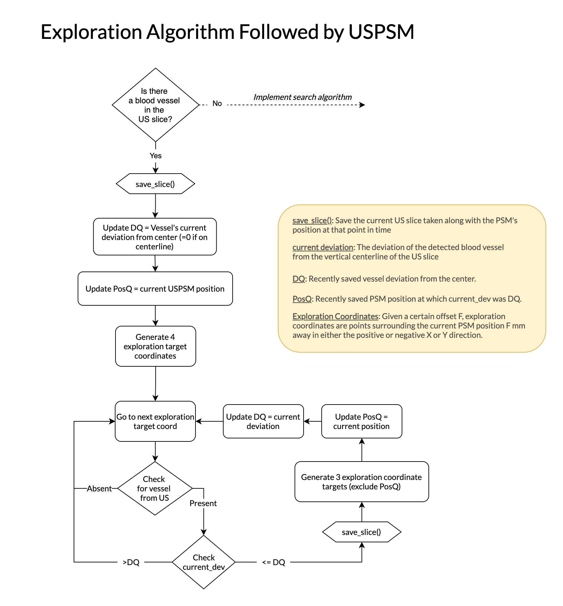
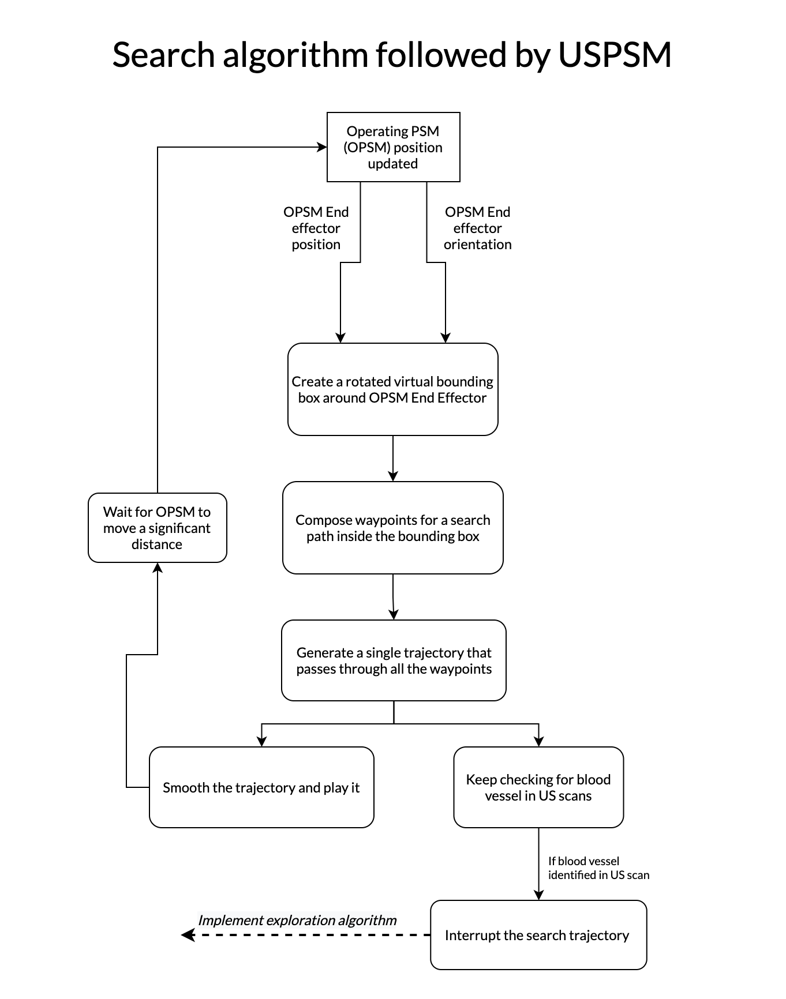

# The Code
All the code developed for the dVRK ultrasound assistant control system project. Refer to this readme file for details about the project as a whole, and for instructions on how to set the environment up.

 

## Documentation
The code is documented pretty well inside each of the python scripts here. Each script begins with a comment block outlining what its purpose is, as well as an overview of the steps taken to achieve that purpose.

 

## The Scripts
Here is a breif overview of what each script here is for.
- `master.py`: Serves as an internal API for this project. Not to be run on its own, but should be imported into other scripts and have its functions called. Includes the most essential functions built throughout the project. All the scripts below import `master.py` and use these functions.
- `add_object.py`: Demonstrate both adding obstacles to the scene programmatically and PSM collision avodiance.
- `bounding_rectangle.py`: This script constructs a rotated rectangle around a given end effector location and orientation. A rotated search path is also produced which the PSM would follow as it searches for the vessel inside the box. Resulting rectangle and path are plotted.
- `cubic_smoothing.py`: Perform cubic spline interpolation on a given set of points that form a trajectory to smooth it out. Can also interpolate to output a desired number of points for the trajectory.
- `pre_explore.py`: Implements a single exploration step. A more basic version of `psm_explore.py`.
- `psm_explore.py`: Performs the exploration algorithm described by the following flowchart:

- `psm_search.py`: Takes in a fake 2D location and Z axis rotation for the OPSM end effector. Uses the `bounding_rectangle` script to generate a rectangle and a search path within. This search path is then fed to the UPSM and it should explore that box by following that path in a single smooth trajectory.

- `read_recording.py`: Read a recorded .npy file with XYZ coordinates and plot the PSM's path. Can plot on either a 2D plane (XY) or a 3D plane (XYZ).
- `dvrk_testbench.py`: Experimenting with the dvrk-ros python library to explore its functions.

 

## Other Directories

The other directories in this folder contain bits and pieces relevant to my work on this project.

- `files/` contains position recordings of the PSM as it was moving. These can be read by `read_recording.py` to be plotted.
- `images/` conatains all the figures plotted through matpotlib and saved locally.
- `stepping_stones/` contains miscellaneous python scripts I used as stepping stones to reach the final few scripts I have here. They are not well documented and do not add any value beyond the scripts presented above.